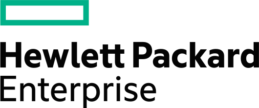

<h1>HPE Aruba Networking Break/Fix with AFC and CX10K</h1>

# Lab Overview
During this session you will be responsible for a spine-leaf network built on the distributed services architecture based of the CX 10000 Switch integrated stateful firewall. Policies and rules are preventing all traffic between two vlans but allowing ssh. There are three trouble tickets in this workshop. Your mission to to resolve all three tickets. You will have hints and a custom tool to help you in resolving these issues.

### Introduction  
The Aruba CX 10000 Series Switch introduces a ground-breaking data center switch category known as Distributed Services Switch (DSS). It combines top-notch Aruba CX data center L2/3 switching capabilities with the industry's pioneering hardware accelerated programmable processor, Pensando P4. This remarkable integration enables stateful firewall services to be delivered inline and at scale, offering wire-rate performance and significant enhancements compared to traditional data center L2/3 switches.  

In this workshop, students will have the opportunity to access two of these innovative switches as top of rack leafs. A HPE Aruba Networking 6300 will be used as a spine switch and all the switches will be managed with the HPE Aruba Networking Fabric Composer (AFC), a powerful API-driven, software-defined orchestration solution.

There are three things that are not configured correctly. Find them. Resolve them.

### Objective
1. Fine the root cause of three different network configuration issues.
2. Resolve the issues.

